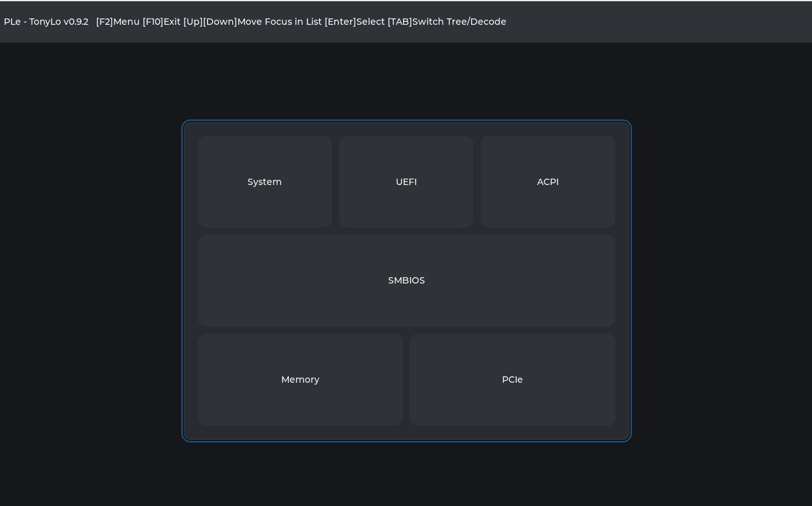
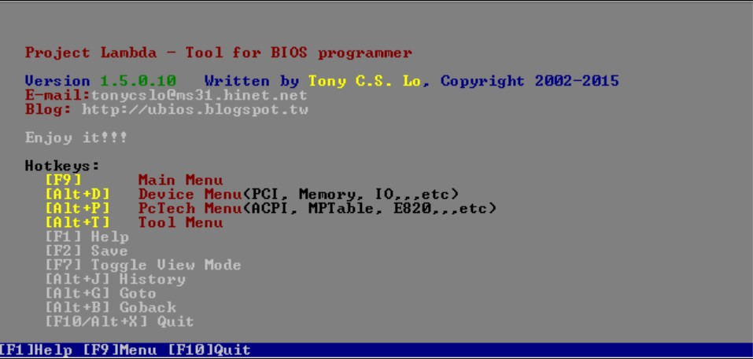
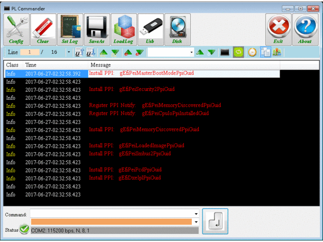

# Firmware Tools Maintained by TonyLo

## Tools

(https://github.com/vangoghynot/UefiResources/tree/master/Tools)

|Tool|Version|OS|Notes|
|:-----------------|:-------------------|:-----------------|:-----------------|
|[ PLe](https://github.com/vangoghynot/UefiResources/tree/master/Tools/PLe) |0.9.3|UEFI|PLe provides dump of below: **1.	PCI/PCI Express ** **2.	System memory ** **3.	ACPI ** **4.	SMBIOS**  **5.	CPU**  **6.	UEFI System Tables/Variables/PCDs**||
|[ PL](https://github.com/vangoghynot/UefiResources/tree/master/Tools/PL) |1.5.0.10|DOS|PL provides dump of below: **1.	PCI Bus/Device Information(PCI register read/write) ** **2.	USB host controller information ** **3.	System memory read/write ** **4.	I/O address read/write ** **5.	Index IO read/write ** **6.	HD-Audio Controller Information (Include immediate VERB command, save codec cmd sequence as c file) ** **7.	AC97 Controller ** **8.	ACPI Table ** **9.	Disk read/write ** **10.	Int15h E820 maps advanced browsing ** **11.	Multi Processor(MP) Table dump. ** **12. Advanced Browsing experience.  ** &nbsp;&nbsp;&nbsp; - Goto alternative view (Alt+G) Example: PCI<>IO or Memory, ACPI<>Memory &nbsp;&nbsp;&nbsp; - Go back previous view(Alt+B)  **13. Save View data to file (Save as TXT, HTML, Binary) ** |
|[ PLC](https://github.com/vangoghynot/UefiResources/tree/master/Tools/PLC) |1.0.1.4|Windows|**1. UEFI/BIOS Smart Debug Information **  - Error/Checkpoint/Guid Message clarification and color highlight  - User defined message filter and color highight (Support two uder defined sets)  - Quick message search and locate debug message  - Save debug message on the fly (save to file)  - Load debug message and analysis **2. Addon Debug Message Functions ** - Calculate the timeing between two marked debug messages, can be used to measure and tune the BIOS POST time.  (Click the 'Time' button on tool bar to open the 'Time' Windows, then use 'SPACE' key to mark the message.  - GUID and Meaniningful name translation   * Lookup the BIOS source code at startup. Once the GUID is displayed in the dbeug message, convert the GUID to the driver/protocol name of the GUID. * (Need to set the 'GUID File Path' in the "Config" window to point to the UEFI/BIOS source code) * (Click the 'Decode Messages' button in the tool bar to enable/disable the trsnslation. **3. USB **  - USB topology map  - Save the USB topology map to TXT or ASL file * - Compare the USB topology map. Can be utilize to check if any USB device loss cross system boots. (support command line mode)  - ACPI ASL _UPC and _PLD generation for USB devices. **4. Disk **  - Need to launch the application in Administrator right.  - View GPT/MBR information  - Check disk boot capability. **5. Console Redirection **  - Click 'Terminal' button in the tool bar to open the console window.  - Support ANSI/VT100 (Similar to Putty/Teraterm)  - Capture screen to file. **6. SUT Control (Control M/B) **  - Need specific hardware  - Support Web http/https request or windows exe/bat to control the M/B - Support 'Level' or Pulse control  - Capable to control the M/B AC power or Power Button **7. UEFI Variable READ **  - Need Administrator Right  - Read UEFI Variable in Windows  |
|IPMI Tools|-[Information](https://www.intel.com.tw/content/www/tw/zh/servers/ipmi/ipmi-technical-resources.html?wapkw=ipmi)-[IPMI, V2.0, Conformance Test Suite (ICTS) Prototype, V6.02](https://www.intel.com.tw/content/dam/www/public/us/en/documents/product-briefs/icts_v602.zip) -[IPMI, V2.0, V1.5, and V1.0, Reference Drivers](https://www.intel.com.tw/content/dam/www/public/us/en/documents/product-briefs/drvjan13_2005.zip) -[IPMI, V2.0, Command Test Tool](https://www.intel.com.tw/content/dam/www/public/us/en/documents/product-briefs/ipmitool_01-13-05.zip)|
|Redfish Tools (DMTF Github)|[Redfish Test Framework](https://github.com/DMTF/Redfish-Test-Framework)|

