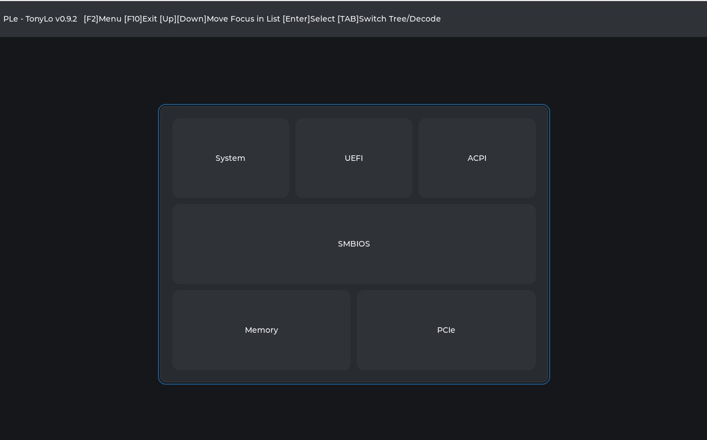
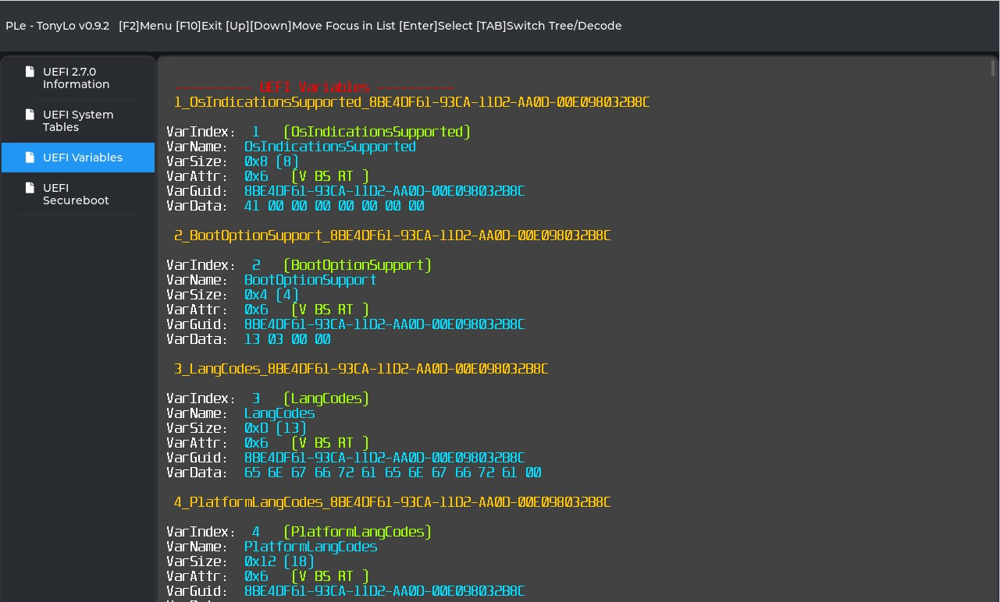
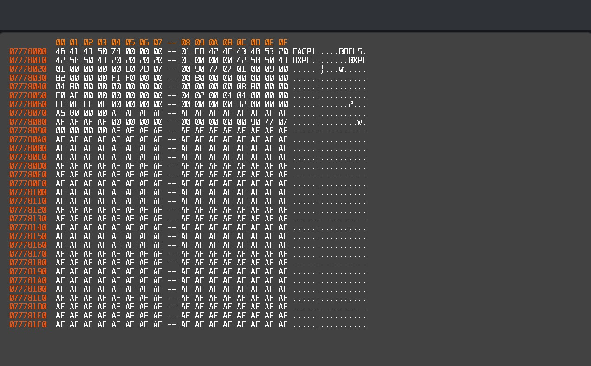
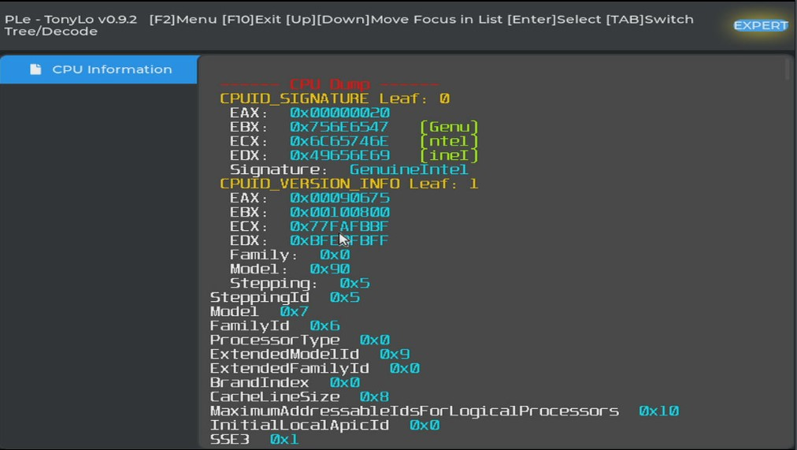
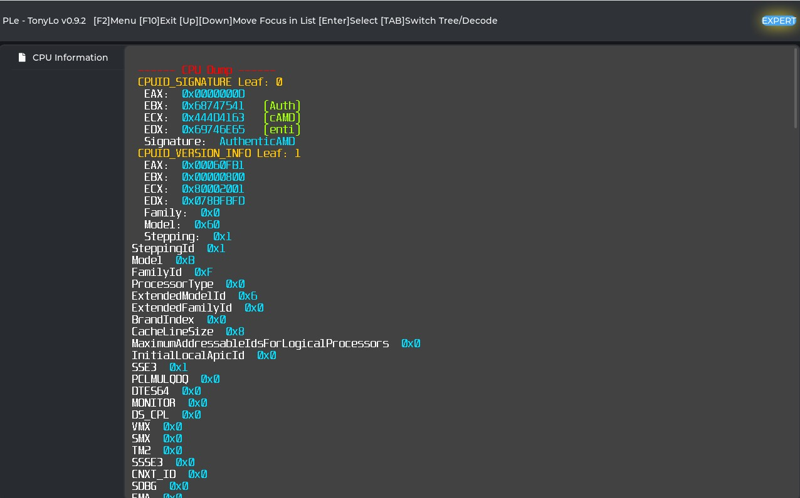

PLe v0.9.2 (x64)

Changes:
- Add CPU dump for x64 processor
- Memory dump improvements
- UEFI variable attributes dump

**HotKeys:** 
**[F2]** Menu 
**[F10]** Exit 
**[TAB]** Switch Tree/View 
**[Enter]** Select View 

View: 
**[Up]**   Move focus up in tree list  
**[Down]** Move focus down in tree list  
**[TAB]** Switch Tree/View 
**[PgDn]** Page down in view 
**[PgUp]** Page up in view  
**[Home]** Begin of view dump  
**[End]** End of view dump  

Memory: 
**[PgDn]**  Memory Page Up 
**[PgUp]** Memory Page Down 
**[Home]** Begin of dump 
**[End]** End of dump 

Available Dumps: 
- ACPI
- PCIe
- SMBIOS
- Memory
- UEFI
- CPU

