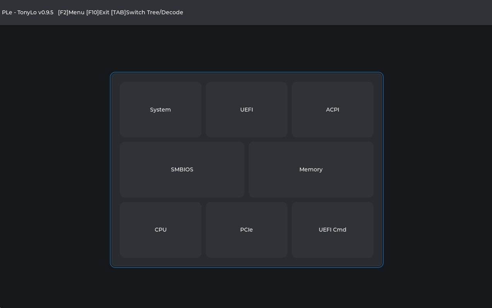
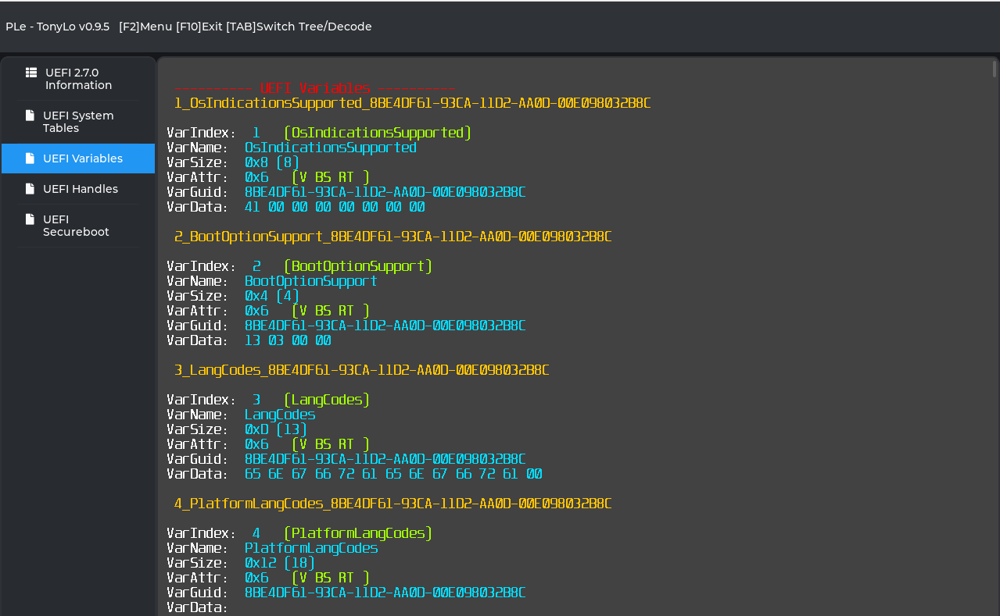
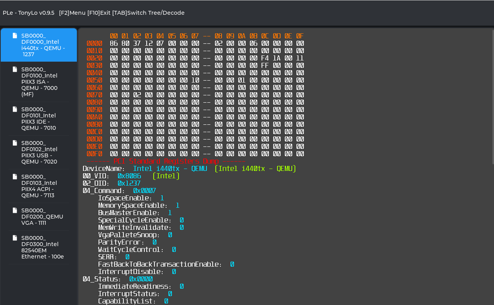
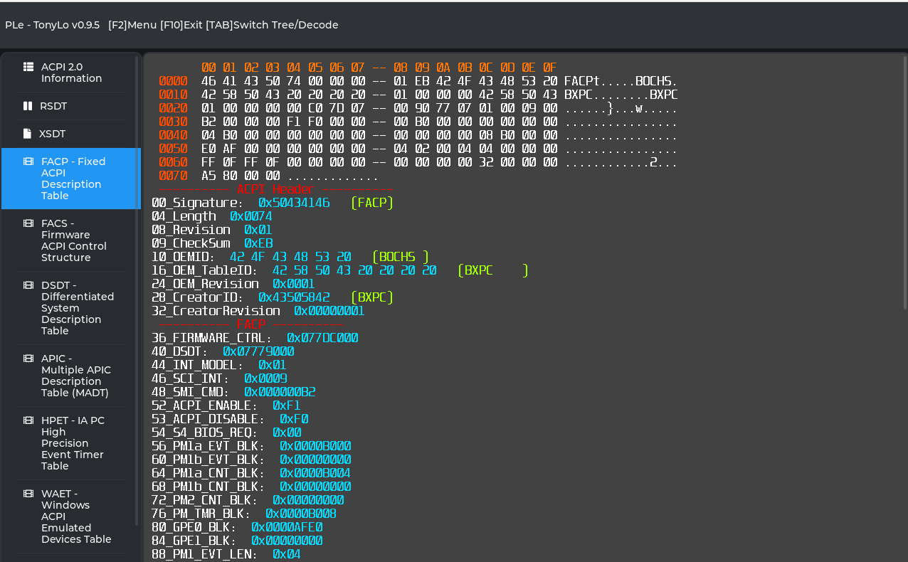
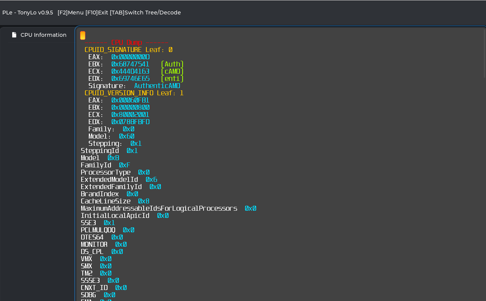
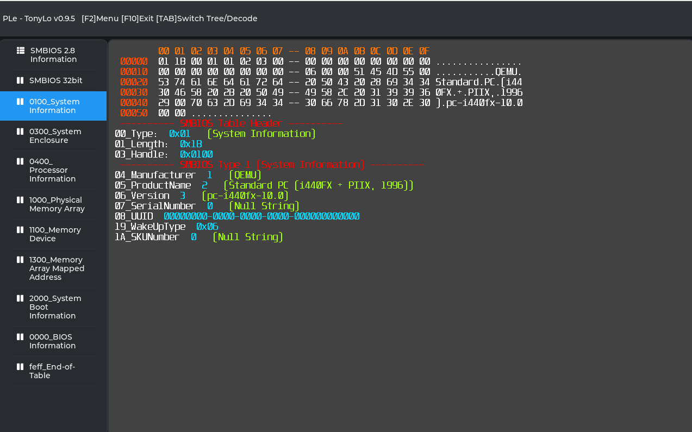

PLe v0.9.5 (x64)

New Functions: 
- CPU Dump 
- UEFI Commander 

**HotKeys:** 
**[F2]** Menu 
**[F10]** Exit 
**[TAB]** Switch Tree/View 
**[Enter]** Select View 

View: 
**[Up]**   Move focus up in tree list  
**[Down]** Move focus down in tree list  
**[TAB]** Switch Tree/View 
**[PgDn]** Page Down 
**[PgUp]** Page Up 
**[Home]** Jump to Begin 
**[End]** Jump to End 

Memory: 
**[PgDn]**  Memory Page Up 
**[PgUp]** Memory Page Down 
**[Home]** Jump to Begin 
**[End]** Jump to End 

Available Dumps: 
- ACPI
- PCIe
- SMBIOS
- Memory
- UEFI
  - UEFI Variables
  - UEFI System Tables
  - UEFI PCDs
- CPU
- UEFI Commander

