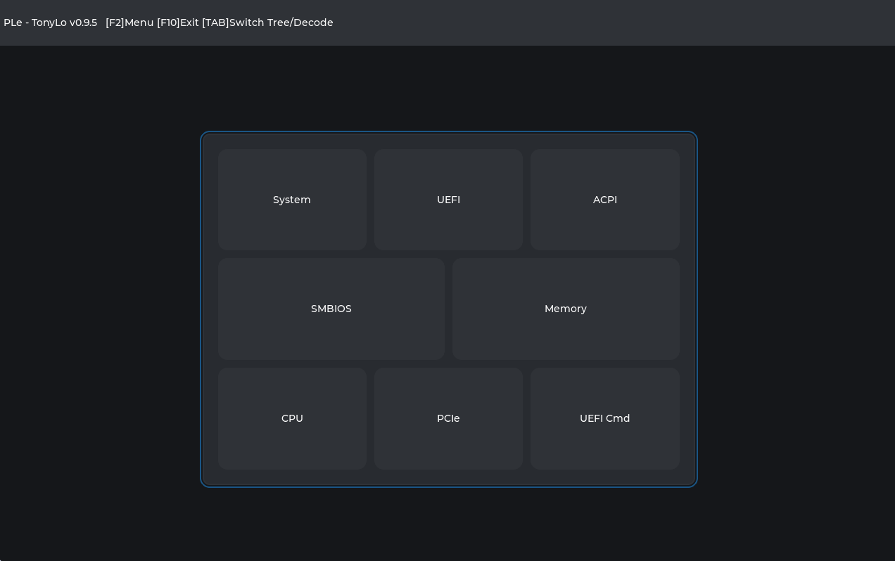
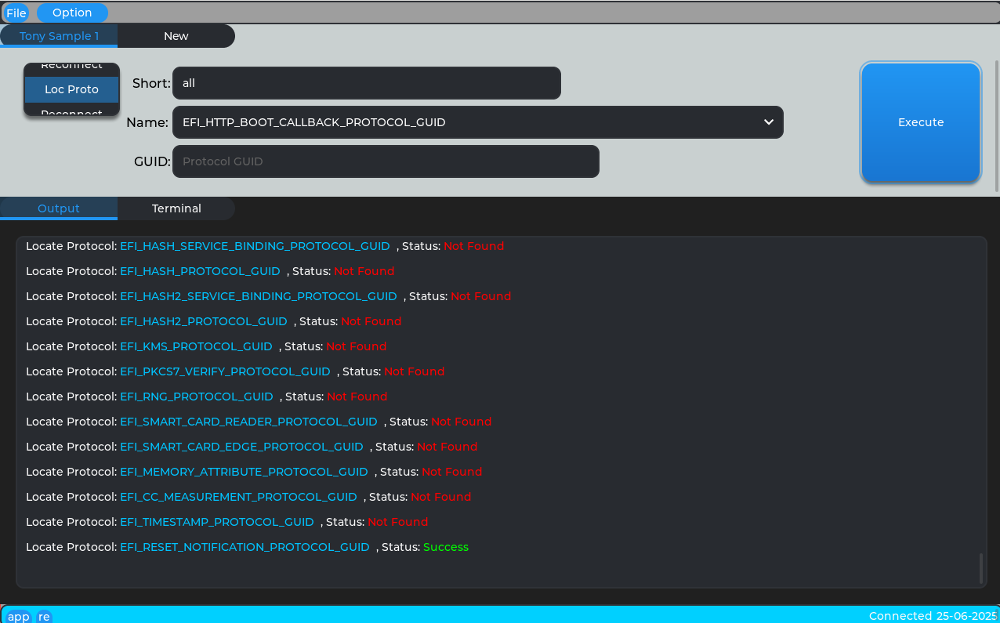

- [History](#history)
  - [PLe v0.9.5 (x64)](#ple-v095-x64)
  - [PLe v0.9.3 (x64)](#ple-v093-x64)
- [HotKeys](#hotkeys)
  - [Normal View:](#normal-view)
  - [Memory:](#memory)
  - [UEFI Commander:](#uefi-commander)

Available Dumps: 
- ACPI
- PCIe
- SMBIOS
- Memory
- UEFI
  - UEFI Variables
  - UEFI Handles
  - UEFI System Tables
  - UEFI PCDs
- CPU (x64 Processor Only)
- UEFI Commander

# History

## PLe v0.9.5 (x64)

New Functions: 
- CPU Dump 
- UEFI Commander 

## PLe v0.9.3 (x64)

Improvements: 
- UEFI Handle Dump 
- PCIe 
- SMBIOS 

# HotKeys

**[F2]** Menu 
**[F10]** Exit 
**[TAB]** Switch Tree/View 
**[Enter]** Select View 

## Normal View: 
**[Up]**   Move focus up in tree list  
**[Down]** Move focus down in tree list  
**[TAB]** Switch Tree/View 
**[PgDn]** Page Down 
**[PgUp]** Page Up 
**[Home]** Jump to Begin 
**[End]** Jump to End 

## Memory: 
**[PgDn]**  Memory Page Up 
**[PgUp]** Memory Page Down 
**[Home]** Jump to Begin 
**[End]** Jump to End 

## UEFI Commander: 
**[TAB]**  Switch Focus UI 
**[Shift+TAB]**  Switch Focus UI 
 In 'Output' logger: 
**[PgDn]**  Page Up 
**[PgUp]** Page Down 
**[Home]** Jump to Begin of log 
**[End]** Jump to End of log 

